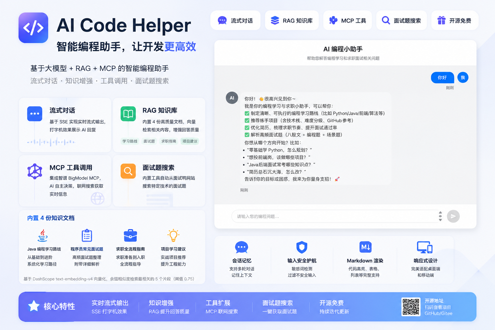

# AI 编程小助手

[](https://www.oracle.com/java/)
[](https://spring.io/projects/spring-boot)
[](https://github.com/langchain4j/langchain4j)
[](https://vuejs.org/)
[](https://vitejs.dev/)
[](https://tongyi.aliyun.com/)


AI 编程小助手是一个基于 LangChain4j + 通义千问大模型的全栈智能编程助手，帮助用户解答编程学习和求职面试相关问题。支持流式对话、RAG 知识库检索增强、MCP 工具调用和面试题搜索等能力。



## 目录

- [特性](#特性)
- [技术栈](#技术栈)
- [项目结构](#项目结构)
- [快速开始](#快速开始)
- [功能说明](#功能说明)
- [部署指南](#部署指南)
- [许可证](#许可证)

## 特性

- **流式对话**：基于 SSE（Server-Sent Events）实现实时流式输出，打字机效果展示 AI 回复
- **RAG 知识库**：内置编程学习路线、面试题、求职指南等文档，通过向量检索增强 AI 回答质量
- **MCP 工具调用**：集成智谱 BigModel MCP 服务，支持联网搜索获取实时信息
- **面试题搜索**：内置工具自动从面试鸭网站抓取相关面试题
- **会话记忆**：支持多轮对话，AI 能记住上下文
- **输入安全护轨**：敏感词检测，过滤不安全的用户输入
- **Markdown 渲染**：AI 回复支持完整的 Markdown 格式（代码高亮、表格、列表等）
- **响应式设计**：前端适配桌面端和移动端

## 技术栈

| 层级 | 技术 |
|------|------|
| 后端框架 | Spring Boot 3.5.4 + Java 21 |
| AI 框架 | LangChain4j 1.1.0 |
| 大模型 | 通义千问（Qwen-Plus）via DashScope |
| 嵌入模型 | text-embedding-v4（DashScope） |
| 工具协议 | MCP（Model Context Protocol） |
| 网页抓取 | Jsoup 1.20.1 |
| 前端框架 | Vue 3 + Vite 4 |
| Markdown | marked.js |
| HTTP 客户端 | Axios |

## 项目结构

```
ai-code-helper/
├── src/main/java/com/ai/aicodehelper/
│   ├── AiCodeHelperApplication.java          # 启动类
│   ├── ai/
│   │   ├── AiCodeHelper.java                 # 基础 AI 对话服务
│   │   ├── AiCodeHelperService.java          # AI Service 接口（声明式）
│   │   ├── AiCodeHelperServiceFactory.java   # AI Service 工厂（组装记忆、RAG、工具等）
│   │   ├── guardrail/
│   │   │   └── SafeInputGuardrail.java       # 输入安全护轨
│   │   ├── listener/
│   │   │   └── ChatModelListenerConfig.java  # 模型调用监听日志
│   │   ├── mcp/
│   │   │   └── McpConfig.java                # MCP 工具配置
│   │   ├── model/
│   │   │   └── QwenChatModelConfig.java      # 通义千问模型配置
│   │   ├── rag/
│   │   │   └── RagConfig.java                # RAG 检索增强配置
│   │   └── tools/
│   │       └── InterviewQuestionTool.java    # 面试题搜索工具
│   ├── config/
│   │   └── CorsConfig.java                   # 跨域配置
│   └── controller/
│       └── AiController.java                 # API 接口
├── src/main/resources/
│   ├── application.yml                        # 应用配置
│   ├── system-prompt.txt                      # 系统提示词
│   └── docs/                                  # RAG 知识库文档
│       ├── Java 编程学习路线.md
│       ├── 程序员常见面试题.md
│       ├── 鱼皮的求职指南.md
│       └── 鱼皮的项目学习建议.md
└── ai-code-helper-frontend/                   # 前端项目
    ├── src/
    │   ├── App.vue                            # 主应用组件
    │   ├── components/
    │   │   ├── ChatInput.vue                  # 输入框组件
    │   │   ├── ChatMessage.vue                # 消息气泡组件
    │   │   └── LoadingDots.vue                # 加载动画组件
    │   └── utils/
    │       └── index.js                       # 工具函数
    ├── package.json
    └── vite.config.js
```

## 快速开始

### 前置条件

- JDK 21+
- Maven 3.8+
- Node.js 18+
- npm 或 pnpm

### 1. 获取 API Key

项目使用通义千问（DashScope）和智谱 BigModel 的 API，需要提前申请：

- [DashScope API Key](https://dashscope.console.aliyun.com/) — 用于通义千问对话和文本嵌入
- [智谱 BigModel API Key](https://open.bigmodel.cn/) — 用于 MCP 联网搜索

### 2. 配置后端

修改 `src/main/resources/application.yml`，填入你的 API Key：

```yaml
langchain4j:
  community:
    dashscope:
      chat-model:
        model-name: qwen-plus
        api-key: your-dashscope-api-key
      embedding-model:
        model-name: text-embedding-v4
        api-key: your-dashscope-api-key
      streaming-chat-model:
        model-name: qwen-plus
        api-key: your-dashscope-api-key

bigmodel:
  api-key: your-bigmodel-api-key
```

### 3. 启动后端

```bash
# 在项目根目录执行
mvn spring-boot:run
```

后端默认运行在 `http://localhost:8011/api`。

### 4. 启动前端

```bash
cd ai-code-helper-frontend
npm install
npm run dev
```

前端默认运行在 `http://localhost:5173`。

## 功能说明

### 流式对话

通过 SSE 实现实时流式输出，前端逐字展示 AI 回复：

```
GET /api/ai/chat?memoryId={id}&message={message}
```

### RAG 知识库

内置 4 份知识文档，覆盖编程学习和求职全流程：

- Java 编程学习路线
- 程序员常见面试题
- 求职全流程指南
- 项目学习建议

文档通过 DashScope text-embedding-v4 模型向量化，使用余弦相似度（阈值 0.75）检索最相关的 5 个片段。

### MCP 工具调用

集成智谱 BigModel 的 MCP 服务，AI 可自主决定是否需要联网搜索来回答问题。

### 面试题搜索

AI 可调用内置工具从面试鸭（mianshiya.com）搜索特定技术的面试题。

## 部署指南

### 后端部署

```bash
# 打包
mvn clean package -DskipTests

# 运行
java -jar target/ai-code-helper.jar
```

### 前端部署

```bash
cd ai-code-helper-frontend
npm run build
```

将 `dist` 目录部署到 Nginx 或其他静态服务器。

### Nginx 参考配置

```nginx
server {
    listen 80;
    server_name your-domain.com;

    # 前端静态资源
    location / {
        root /path/to/ai-code-helper-frontend/dist;
        try_files $uri $uri/ /index.html;
    }

    # 后端 API 代理
    location /api/ {
        proxy_pass http://localhost:8011/api/;
        proxy_set_header Host $host;
        proxy_set_header X-Real-IP $remote_addr;

        # SSE 流式响应支持
        proxy_http_version 1.1;
        proxy_set_header Connection '';
        proxy_buffering off;
        chunked_transfer_encoding off;
        proxy_cache off;
    }
}
```

## 许可证

[MIT License](LICENSE)
